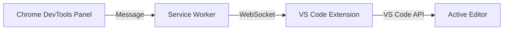

# Locate in Code

The **Locate in Code** feature bridges the "Context Gap" between the browser and your editor. It allows you to inspect an element in the browser and instantly jump to the exact file and line in VS Code where that element's styles or component is defined.

## Architecture Overview

The system operates as a **Client-Relay-Server** architecture to bypass browser sandboxing limitations.

1.  **The Client (Chrome Extension):** Extracts CSS selectors and metadata from the DOM.
2.  **The Relay (Service Worker):** Maintains a persistent WebSocket connection to the local machine.
3.  **The Server (VS Code Extension):** A local WebSocket server (default port `3000`) that has full access to the project filesystem.

---

## The 4-Step Lifecycle

### 1. Element Extraction
When you pick an element or click "Locate," the extension generates a **Semantic Selector Path**. 
*   **Example:** `p.product-title.text-blue-500.font-bold`
*   It captures the tag name, all classes (including Tailwind utilities), and the ID.

### 2. Message Relay
The DevTools panel sends a `BRIDGE_COMMAND` to the background Service Worker. The Service Worker wraps this into a JSON payload and transmits it over a local WebSocket (`ws://localhost:3000`).

### 3. Smart Search (The "Brain")
Once the VS Code Bridge receives the selector, it doesn't just do a simple "Find." It runs a **Multi-Stage Confidence Search**:

#### A. Tokenization
The selector is split into individual tokens:
*   `#` (ID)
*   `.` (Classes)
*   Tags

#### B. Utility Filtering
The engine identifies and down-ranks common utility classes (e.g., Tailwind, Bootstrap) to avoid "noise."
*   **Utility Prefixes ignored:** `p-`, `m-`, `w-`, `flex`, `text-`, `bg-`, `hover:`, etc.
*   **Result:** The search focuses on your **Unique** classes (e.g., `.product-card`) instead of `.flex`.

#### C. Confidence Scoring
Every file in the workspace is scanned and assigned a "Confidence Score":

| Criteria | Score | Rationale |
| :--- | :--- | :--- |
| **ID Match** | +100 | IDs are globally unique; 100% confidence. |
| **Unique Class** | +20 | Custom classes define the component's identity. |
| **Utility Class** | +10 | Validates we are in the right block. |
| **Active File** | +50 | High probability you are working in the open file. |

### 4. Navigation
The file with the highest score is selected. The extension uses the `vscode.window.showTextDocument` API to:
1.  Open the file.
2.  Scroll to the line containing the best-matching token.
3.  Set the cursor and highlight the line.

---

## Configuration

### Setting the Port
By default, the Bridge uses port **3000**. If you have a port conflict:

1.  **In VS Code:** Go to `Settings > UI Checker Bridge > Port` and change to `3001`.
2.  **In Chrome Extension:** Go to `Workspace Settings > Bridge Port` and change to `3001`.

The connection will automatically handshake and show a `$(zap)` icon in the VS Code status bar when active.

---

## Troubleshooting

### "Receiving end does not exist"
This usually happens if the Chrome Extension was updated/reloaded but the target website hasn't been refreshed. 
*   **Solution:** Refresh your browser tab (`localhost:3000`).

### "Not Found" Feedback
If the button turns red and says "Not Found," it means the Smart Search couldn't find a high-enough confidence match.
*   **Common cause:** The element is generated dynamically or the classes are obfuscated (CSS Modules/Styled Components).
*   **Solution:** Use the **Manual Selector** input to search for a more stable parent container.

### Connection Offline
Ensure the VS Code Bridge is running. Check the bottom right corner of VS Code for the status badge. If it's offline, click the badge to restart the server.
